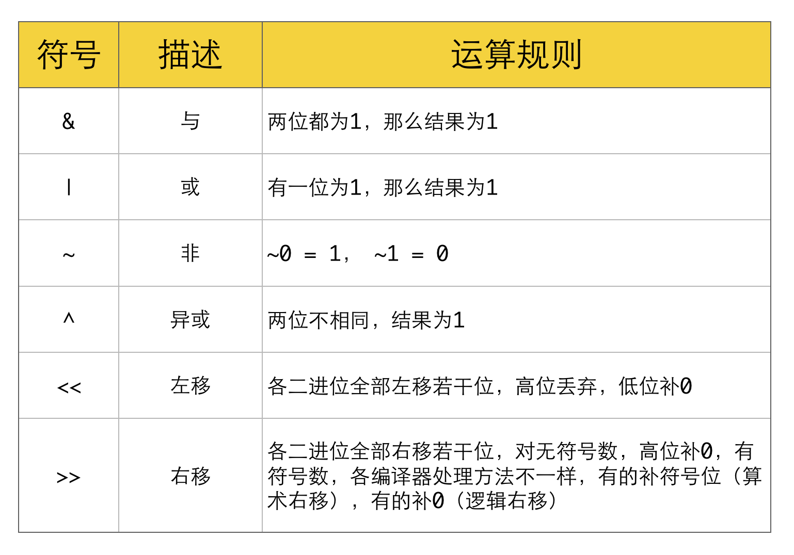

# LeetCode

> LeetCode刷题笔记，语言Java，记录刷题过程中的某些思路、代码、涉及知识点和解题Tips。

## Easy

#### [7. 整数反转](https://leetcode-cn.com/problems/reverse-integer/)

1. 字符串做法，直接利用StringBuffer的reverse()方法，利用api不训练码力，代码略。

2. 数学做法，具体解释见TSP：逆推数字

   题中有个隐藏的坑，x是有范围的，如果翻转后超出范围则不能算翻转

```java
class Solution {
    public int reverse(int x) {
        long n = 0;
        // 3、当x是0的时候，说明输入数已经从后往前还原完毕
        while(x!=0){
            // 1、这个公式将不断从后往前还原输入数x
            n = n*10+x%10;
            // 2、如果当前数小于10，则/10后等于0
            x = x/10;
        }
        // 此时n就是反转之后的x
        return (int)n==n?(int)n:0;
    }
}
```

#### [9. 回文数](https://leetcode-cn.com/problems/palindrome-number/)

1. 字符串做法，直接利用StringBuffer的reverse()方法，利用api不训练码力，代码略。
2. 数学做法，具体解释见TSP：逆推数字。

```java
class Solution {
    public boolean isPalindrome(int x) {
        if(x==0){
            return true;
        }
        if(x<0||x%10==0){
            return false;
        }
        int reversed = 0;
        // reversed是从后往前复现这个数
        while(x>reversed){
            reversed = reversed*10+x%10;
            x/=10;
        }
        //如果复现的数和x相等的话，则倒推和正推是相等的，即是回文数
        return x==reversed||x==reversed/10;

    }
}
```

#### [70. 爬楼梯](https://leetcode-cn.com/problems/climbing-stairs/)

```java
class Solution {
    public int climbStairs(int n) {
        int a = 1,b=2,tmp;
        if(n<=2){
            return n;
        }
        for(int i=3;i<=n;i++){
            tmp=a;
            a=b;
            b=tmp+b;
        }
        return b;
    }
}
```

#### [121. 买卖股票的最佳时机](https://leetcode-cn.com/problems/best-time-to-buy-and-sell-stock/)

DP做法，

```java
class Solution {
    public int maxProfit(int[] prices) {
        if(prices.length <= 1)
            return 0;
        //截止到当日，最小的价格min，因为第一天，所以最小的价格就是第一天的价格
        //截止到当日，最大的差值max，因为第一天还没卖，所以最大价差还是0
        int min = prices[0], max = 0;
        // 从第二天开始，将之前的最大价差，与(今日价格-之前最低价)做比较，留下比较后的最大价差
        // 然后，比较今日价格与之前的最低价，留下比较后的最低价
        // 注意，max要先算，不能在min更新后再计算max
        for(int i = 1; i < prices.length; i++) {
            max = Math.max(max, prices[i] - min);
            min = Math.min(min, prices[i]);
        }
        return max;
    }
}
```

#### [169. 多数元素](https://leetcode-cn.com/problems/majority-element/)

```java
class Solution {
    public int majorityElement(int[] nums) {
        // 摩尔投票法
        /**
        思路：三国交战，且交战时，每个士兵都和一个士兵同归于尽。
        假设我国人数大于三国总人数的一半，遇到一个敌方士兵减一，遇到己方士兵加一
        按这个算法，遍历到最后，我方人数一定是大于0，
        ===========================================================================
        疑问：为什么等于0的时候要换数？
        解答：等于0的时候说明之前选定的国至此已全部抵消，后面如果这个国人数还是占优，那最后还是这个国胜利
             那就先看当前这个国能撑多久。
         */
        int cnt = 1;
        int role = nums[0];
        for(int i=1;i<nums.length;i++){
            if(role==nums[i]){
                cnt++;
            }else{
                cnt--;
            }
            if(cnt==0){
                role = nums[i];
                cnt = 1;
            }
        }
        return role;
    }
}
```

#### [509. 斐波那契数](https://leetcode-cn.com/problems/fibonacci-number/)

1. 递归做法

```java
// 有多种做法
class Solution {
    public int fib(int n) {
        if(n<=1){
            return n;
        }
        return fib(n-1)+fib(n-2);
    }
}
```

2. DP做法

```java
```


#### [1118. 一月有多少天](https://leetcode-cn.com/problems/number-of-days-in-a-month/)

这题不讨论，主要是对闰年及其所属月份的了解。

```java
class Solution {
    public int numberOfDays(int Y, int M) {
        int[] runnian = {31, 29, 31, 30, 31, 30, 31, 31, 30, 31, 30, 31}; // 闰年
        int[] norunnian = {31, 28, 31, 30, 31, 30, 31, 31, 30, 31, 30, 31}; // 非闰年
        if((Y % 100 != 0 && Y % 4 == 0) || Y % 400 == 0) {
            return runnian[M-1];
        }
        return norunnian[M-1];
    }
}
```

#### [217. 存在重复元素](https://leetcode-cn.com/problems/contains-duplicate/)

1. 去重做法，去重后长度小于原长度，则表明存在重复值。

```java
class Solution {
    public boolean containsDuplicate(int[] nums) {
        Set<Integer> s = new HashSet<>();
        for(int num:nums){
            s.add(num);
        }
        return s.size()<nums.length?true:false;
    }
}
```

#### [1876. 长度为三且各字符不同的子字符串](https://leetcode-cn.com/problems/substrings-of-size-three-with-distinct-characters/)

```java
class Solution {
    public int countGoodSubstrings(String s) {
        if(s.length()<3){
            return 0;
        }
        int count =0;
        //注意循环结束条件的取值范围,指针只要取到倒数第三位即可
        for(int i=0;i<s.length()-2;i++){
            if((s.charAt(i)!=s.charAt(i+1))&&(s.charAt(i+1)!=s.charAt(i+2))&&(s.charAt(i)!=s.charAt(i+2))){
                count++;
            }
        }
        return count;
    }
}
```

#### [LCP 01. 猜数字](https://leetcode-cn.com/problems/guess-numbers/)

不讨论，较为简单。

```java
class Solution {
    public int game(int[] guess, int[] answer) {
        int count = 0;
        for(int i=0;i<3;i++){
            if(guess[i]==answer[i]){
                count++;
            }
        }
        return count;
    }
}
```

#### [1085. 最小元素各数位之和](https://leetcode-cn.com/problems/sum-of-digits-in-the-minimum-number/)

先得出数组最小值，然后根据TSP：逆推数字 做各数位加和，最后判断奇偶。

```java
class Solution {
    public int sumOfDigits(int[] nums) {
        int min = nums[0];
      // 需要了解一下为什么不用Arrays.sort()?
        for(int i=0;i<nums.length;i++){
            min = Math.min(min,nums[i]);
        }
        int sum=0;
        while(min!=0){
            sum+=min%10;
            min/=10;
        }
        return sum%2==0?1:0;
    }
}
```

#### [1119. 删去字符串中的元音](https://leetcode-cn.com/problems/remove-vowels-from-a-string/)

不讨论，利用正则即可。

```java
class Solution {
    public String removeVowels(String s) {
        // 正则做法
        return s.replaceAll("[aeiou]","");
    }
}
```

#### [LCP 17. 速算机器人](https://leetcode-cn.com/problems/nGK0Fy/)

较简单，不讨论。

```java
class Solution {
    public int calculate(String s) {
        int x=1,y=0;
        for(char c:s.toCharArray()){
            if(c=='A'){
                x = 2*x+y;
            }else{
                y = 2*y+x;
            }
        }
        return x+y;
    }
}
```

#### [2000. 反转单词前缀](https://leetcode-cn.com/problems/reverse-prefix-of-word/)

```java
class Solution {
    public String reversePrefix(String word, char ch) {
        int ind = word.indexOf(ch);
        StringBuffer s = new StringBuffer(word.substring(0,ind+1));
    return s.reverse().append(word.substring(ind+1)).toString();
    }   
}
```

#### [2011. 执行操作后的变量值](https://leetcode-cn.com/problems/final-value-of-variable-after-performing-operations/)

较简单，不讨论。

```java
class Solution {
    public int finalValueAfterOperations(String[] operations) {
        int x = 0;
        for(String t:operations){
            if(t.contains("+")){
                x++;
            }else{
                x--;
            }
        }
        return x;
    }
}
```

#### [1491. 去掉最低工资和最高工资后的工资平均值](https://leetcode-cn.com/problems/average-salary-excluding-the-minimum-and-maximum-salary/)

排序，然后加和范围是去掉最大最小值的中间那些数。

```java
class Solution {
    public double average(int[] salary) {
        Arrays.sort(salary);
        int sum=0;
        for(int i=1;i<salary.length-1;i++){
            sum+=salary[i];
        }
        return sum/(salary.length-2.0);
    }
}
```

#### [1550. 存在连续三个奇数的数组](https://leetcode-cn.com/problems/three-consecutive-odds/)

计数思路，遇到奇数就加1，当计数cnt到达3就退出。

```java
class Solution {
    public boolean threeConsecutiveOdds(int[] arr) {
        int cnt = 0;
        for(int a:arr){
            if(a%2!=0){
                cnt++;
            }else{
                cnt=0;
            }
            if(cnt==3){
                return true;
            }
        }
        return false;
    }
}
```

#### [441. 排列硬币](https://leetcode-cn.com/problems/arranging-coins/)

当前硬币数大于等于下一层阶梯的位置数时，则当前硬币数为可排满下一层，如不满足，返回上一层台阶的序号。

```java
class Solution {
    public int arrangeCoins(int n) {
        // 每层可放置的个数，同时也是台阶序号
        int cnt = 1;
        while(n>=cnt){
            n = n-cnt;
            cnt++;
        }
        return cnt-1;
    }
}
```

#### [485. 最大连续 1 的个数](https://leetcode-cn.com/problems/max-consecutive-ones/)

遍历数组，当遇到1时计数，遇到0时说明1的序列断开，此时统计下max，同时计数清零。循环结束后，拿此时的cnt和统计的max再做一次比较。

```java
class Solution {
    public int findMaxConsecutiveOnes(int[] nums) {
        int cnt = 0;
        int max = 0;
        for(int i:nums){
            if(i==1){
                cnt++;
            }else{
                max = Math.max(max,cnt);
                cnt=0;
            }
        }
        return Math.max(max,cnt);
    }
}
```

#### [LCP 06. 拿硬币](https://leetcode-cn.com/problems/na-ying-bi/)

找到规律的做法

```java
class Solution {
    public int minCount(int[] coins) {
        int cnt = 0;
        for(int i:coins){
            if(i%2==0){
                cnt+=i/2;
            }else{
                cnt+=i/2+1;
            }
        }
        return cnt;
    }
}
```

另一种办法，

```java
class Solution {
    public int minCount(int[] coins) {
        int cnt = 0;
        for(int i:coins){
            while(i>0){
                cnt++;
                i-=2;
            }
        }
        return cnt;
    }
}
```

#### [1281. 整数的各位积和之差](https://leetcode-cn.com/problems/subtract-the-product-and-sum-of-digits-of-an-integer/)

利用TSP：逆推数字的思路。

```java
class Solution {
    public int subtractProductAndSum(int n) {
        int ji = 1,he = 0;
        while(n!=0){
            ji *= n%10;
            he += n%10;
            n/=10;
        }
        return ji-he;
    }
}
```

#### [1295. 统计位数为偶数的数字](https://leetcode-cn.com/problems/find-numbers-with-even-number-of-digits/)

1. String.valueOf()方法，不提升码力，代码略。
2. 使用TSP：逆推数字 的思路。

```java
class Solution {
    public int findNumbers(int[] nums) {
        //偶数个数的计数
        int cnt =0;
        for(int i:nums){
            // 位数的计数n
            int n  = 0;
            while(i>0){
                i/=10;
                n++;
            }
            cnt+=n%2==0?1:0;//这种风格可以学下
        }
        return cnt;
    }
}
```

#### [1475. 商品折扣后的最终价格](https://leetcode-cn.com/problems/final-prices-with-a-special-discount-in-a-shop/)

1. 双循环做法，比较直观，易理解。

```java
class Solution {
    public int[] finalPrices(int[] prices) {
        for(int i=0;i<prices.length-1;i++){
            for(int j=i+1;j<prices.length;j++){
                if(prices[i]>=prices[j]){
                    prices[i] -=prices[j];
                    break;
                }
            }
        }
        return prices;
    }
}
```

2. 单调栈做法，学习一下

```java
class Solution {
    public int[] finalPrices(int[] prices) {
        Stack<Integer> s=new Stack<>();
        for(int i=0;i<prices.length;i++){
            //能在栈里面呆着说明还没找到右边第一个比它小的
            while(!s.isEmpty()&&prices[s.peek()]>=prices[i]){
                prices[s.pop()]-=prices[i];
            }
            s.push(i);
        }
        return prices;
    }
}
```

#### [1304. 和为零的N个唯一整数](https://leetcode-cn.com/problems/find-n-unique-integers-sum-up-to-zero/)

```java
```

#### [1342. 将数字变成 0 的操作次数](https://leetcode-cn.com/problems/number-of-steps-to-reduce-a-number-to-zero/)

比较容易，不讨论。

```java
class Solution {
    public int numberOfSteps(int num) {
        int cnt = 0;
        while(num!=0){
            if(num%2==0){
                num/=2;
            }else{
                num-=1;
            }
            cnt++;
        }
        return cnt;
    }
}
```


#### [125. 验证回文串](https://leetcode-cn.com/problems/valid-palindrome/)

双指针做法，最左边和最右边设置起始指针，左指针向右走(++)，右指针向左走(--)，遇到非字母和数字就继续走，遇见字母和数字时，检查当前左指针是否超过右指针，如不超过，则检查各自指针所指的值是否相等，一旦过程中有不符合的，就退出。

```java
class Solution {
    public boolean isPalindrome(String s) {
        s = s.toLowerCase();
        int left = 0,right = s.length()-1;
        while(left<right){
            // 左指针向右，当左指针小于右指针且当前位置非字母和数字时，向右移动一位。
            while(left<right&&!Character.isLetterOrDigit(s.charAt(left))){
                left++;
            }   
            // 右指针向左，当右指针大于左指针且当前位置非字母和数字时，向左移动一位。
            while(left<right&&!Character.isLetterOrDigit(s.charAt(right))){
                right--;
            }
            // 此时左右指针都停在字母或数字上，比较两值是否相等，如果不相等就说明不对称，退出。
            if(s.charAt(left)!=s.charAt(right)){
                return false;
            }
            // 如果两值相等的话，继续各自进一位，
            // 然后继续执行上面代码，直到各自又遇到字母或数字时比较，
            // 如果已经是left>=right时，说明两指针已经相遇，则退出循环。
            left++;
            right--;
        }
        return true;
    }
}
```

#### [680. 验证回文字符串 Ⅱ](https://leetcode-cn.com/problems/valid-palindrome-ii/)

```java
class Solution {
    public boolean validPalindrome(String s) {
        int left = 0,right = s.length()-1;
        while(left<right){
            if(s.charAt(left)!=s.charAt(right)){
                return flag(s,left+1,right)||flag(s,left,right-1);
            }
            left++;
            right--;
        }
        return true;
    }

    // 判断子字符串是否回文
    public boolean flag(String s,int left,int right){
        while(left<right){
            if(s.charAt(left++)!=s.charAt(right--)){
                return false;
            }
        }
        return true;
    }
}
```

#### [628. 三个数的最大乘积](https://leetcode-cn.com/problems/maximum-product-of-three-numbers/)

较简单，不讨论，注意负数情况。

```java
class Solution {
    public int maximumProduct(int[] nums) {
        Arrays.sort(nums);
        int length = nums.length-1;
        return Math.max(nums[length]*nums[length-1]*nums[length-2],nums[0]*nums[1]*nums[length]);
    }
}
```

#### [412. Fizz Buzz](https://leetcode-cn.com/problems/fizz-buzz/)

比较简单，注意for的条件即可。

```java
class Solution {
    public List<String> fizzBuzz(int n) {
        ArrayList<String> answer = new ArrayList<>();
        for(int i=1;i<=n;i++){
            if(i%3==0&&i%5==0){
                answer.add("FizzBuzz");
            }else if(i%3==0){
                answer.add("Fizz");
            }else if(i%5==0){
                answer.add("Buzz");
            }else{
                answer.add(String.valueOf(i));
            }
        }
        return answer;
    }
}
```

#### [1154. 一年中的第几天](https://leetcode-cn.com/problems/day-of-the-year/)

不讨论，数学题。

```java
class Solution {
    public int dayOfYear(String date) {
        int year = Integer.parseInt(date.substring(0,4));
        int month = Integer.parseInt(date.substring(5,7));
        int day = Integer.parseInt(date.substring(8));
        int[] monthArray = {31,28,31,30,31,30,31,31,30,31,30,31};
        if((year % 4 == 0 && year % 100 != 0) || (year % 400 == 0)) {
            monthArray[1] = 29;
        }
        int sum = 0;
        for (int i = 0; i < month - 1; i++) {
            sum += monthArray[i];
        }
        sum += day;
        return sum;
    }
}
```

#### [1822. 数组元素积的符号](https://leetcode-cn.com/problems/sign-of-the-product-of-an-array/)

定义一个负数标记，当数组中有0时，积为0；当出现偶数个负数时，积为整数，出现奇数个负数时，积为负数。

```java
class Solution {
    public int arraySign(int[] nums) {
        boolean isNegative = false;
        for(int num:nums){
            if(num==0){
                return 0;
            }
            if(num<0){
                isNegative=!isNegative;
            }
        }
        return isNegative?-1:1;
    }
}
```

#### [1716. 计算力扣银行的钱](https://leetcode-cn.com/problems/calculate-money-in-leetcode-bank/)

```java
```

#### [1228. 等差数列中缺失的数字](https://leetcode-cn.com/problems/missing-number-in-arithmetic-progression/)

由题意，收尾数字不删，只删中间一个数字，所以可以利用等差数列求和公式减去数组加和

```java
class Solution {
    public int missingNumber(int[] arr) {
        int sum_all = (arr.length+1)*(arr[0]+arr[arr.length-1])/2;
        int sum=0;
        for(int i:arr){
            sum+=i;
        }
        return sum_all-sum;
    }
}
```

#### [1812. 判断国际象棋棋盘中一个格子的颜色](https://leetcode-cn.com/problems/determine-color-of-a-chessboard-square/)

由题可知，字符和为奇数为白色，反之黑色。

```java
class Solution {
    public boolean squareIsWhite(String coordinates) {
        if((coordinates.charAt(0)+coordinates.charAt(1))%2==0){
            return false;
        }
        return true;
    }
}
```

### 迷

#### [292. Nim 游戏](https://leetcode-cn.com/problems/nim-game/)

1.  DP做法，待补充

2. TSP:巴什博奕，但不提升码力

```java
class Solution {
    public boolean canWinNim(int n) {
        return n%4!=0?true:false;
    }
}
```

#### [1025. 除数博弈](https://leetcode-cn.com/problems/divisor-game/)

由题意可得以下推论：n至少是2、谁最后拿到2时谁赢

如果a拿到奇数，由条件n%x==0可知，x必为奇数，b拿到的n-x必为偶数，此时b拿到偶数减1，则a拿到的必为奇数，以上情况继续，最后b拿到最小偶数，b赢。

反之，如果a拿到偶数，至少减1，则给到b的就是奇数，至少减1，那么给到a就是偶数，如此，到最后就是a得到最小偶数，a赢。

综上，只要看n是否为偶数，偶数则true，奇数false。

```java
class Solution {
    public boolean divisorGame(int n) {
        return n%2==0?true:false;
    }
}
```

#### [319. 灯泡开关](https://leetcode-cn.com/problems/bulb-switcher/)

思路没有完全理解透彻，待补充...

```java
class Solution {
    public int bulbSwitch(int n) {
        return (int)Math.sqrt(n);
    }
}
```


### 位运算

#### [67. 二进制求和](https://leetcode-cn.com/problems/add-binary/)

```java
```

#### [136. 只出现一次的数字](https://leetcode-cn.com/problems/single-number/)

利用异或

```java
class Solution {
    public int singleNumber(int[] nums) {
        return Arrays.stream(nums).reduce((a,b)->a^b).getAsInt();
    }
}
```

#### [190. 颠倒二进制位](https://leetcode-cn.com/problems/reverse-bits/)

```java
```

#### [191. 位1的个数](https://leetcode-cn.com/problems/number-of-1-bits/)

```java
```

#### [231. 2 的幂](https://leetcode-cn.com/problems/power-of-two/)

1. 位运算解法1

```java
class Solution {
    public boolean isPowerOfTwo(int n) {
        return n > 0 && (n & (n - 1)) == 0;
    }
}
```

2. 位运算解法2

```java
class Solution {
    public boolean isPowerOfTwo(int n) {
        return n > 0 && (n & (-n)) == n;
    }
}
```


### 双指针

#### [26. 删除有序数组中的重复项](https://leetcode-cn.com/problems/remove-duplicates-from-sorted-array/)

因为是有序数组，所以比较前后两个值(ab)是否相同，如果相同说明重复，下标前进一步，同时当前值a换为后值b；如果不同则继续。

```java
class Solution {
    public int removeDuplicates(int[] nums) {
        int i=0;
      // 题中并未说明数组长度一定大于2
        if(nums.length<2){
            return nums.length;
        }
        for(int j=1;j<nums.length;j++){
            if(nums[i]!=nums[j]){
                i++;//i为多少则重复的数有多少
                nums[i]=nums[j];
            }
        }
        return i+1;
    }
}
```

#### [27. 移除元素](https://leetcode-cn.com/problems/remove-element/)

```java
```


#### [344. 反转字符串](https://leetcode-cn.com/problems/reverse-string/)

1. 双指针两端向内替换

```java
class Solution {
    public void reverseString(char[] s) {
        char left,right;
        for(int i=0,j=s.length-1;i<j;i++,j--){
            // 获取左指针值
            left = s[i];
            // 获取右指针值
            right = s[j];
            // 将数组右边的值改成左指针值
            s[j] = left;
            // 将数组左边的值改成右指针值
            s[i] = right;
        }
    }
}
```

2. 下标折半法

   左下标和右下标是有对应关系的

```java
class Solution {
    public void reverseString(char[] s) {
        char temp;
        for(int i=0;i<s.length/2;i++){
            temp = s[i];
            s[i] = s[s.length-i-1];
            s[s.length-i-1] = temp;
        }
    }
}
```

#### [167. 两数之和 II - 输入有序数组](https://leetcode-cn.com/problems/two-sum-ii-input-array-is-sorted/)

双指针法，共同向内逼近，因为是有序数组，所以如果双指针加和如果大于target，j减1，反之i加1。

```java
class Solution {
    public int[] twoSum(int[] numbers, int target) {
        for(int i=0,j=numbers.length-1;i<j;){
            if(numbers[i]+numbers[j]==target){
               return new int[]{i+1,j+1}; 
            }else if(numbers[i]+numbers[j]>target){
                j--;
            }else{
                i++;
            }
        }
        return null;
    }
}
```

#### [35. 搜索插入位置](https://leetcode-cn.com/problems/search-insert-position/)

注意mid的赋值，`int mid = left+(right-left)/2`，这个写法可以规避`(left+right)/2`溢出的情况；

因为是二分法查找，所以

- 如果target大于中间值，则说明target在中轴右侧，则窗口的左边界要右移到中轴
- 如果target小于中间值，则说明target在中轴左侧，则窗口的右边界要左移到中轴

```java
class Solution {
    public int searchInsert(int[] nums, int target) {
        // 按题意需使用时间复杂度为O(log n)的算法，考虑二分查找。
        int left = 0,right = nums.length-1;
        while(left<=right){
            int mid = left+(right-left)/2;
            if(nums[mid]==target){
                return mid;
            }else if(nums[mid]<target){
                left = mid+1;
            }else if(nums[mid]>target){
                right = mid-1;
            }
        }
        return left;
    }
}
```


### 数学

#### [976. 三角形的最大周长](https://leetcode-cn.com/problems/largest-perimeter-triangle/)

排序后，从后往前找满足两边之和大于第三边的，即面积最大。

```java
class Solution {
    public int largestPerimeter(int[] nums) {
        Arrays.sort(nums);
        int len = nums.length;
        for(int i=len-1;i>=2;i--){
            int a = nums[i];
            int b = nums[i-1];
            int c = nums[i-2];
            if(b+c>a){
                return a+b+c;
            }
        }
        return 0;
    }
}
```

#### [1056. 易混淆数](https://leetcode-cn.com/problems/confusing-number/)

```java

```

#### [258. 各位相加](https://leetcode-cn.com/problems/add-digits/)

考验数学，不讨论。

```java
class Solution {
    public int addDigits(int num) {
        return (num-1)%9+1;
    }
}
```

#### [1134. 阿姆斯特朗数](https://leetcode-cn.com/problems/armstrong-number/)

主要是利用TSP：Math.log10计算数字位数

```java
class Solution {
    public boolean isArmstrong(int n) {
        int k  = (int)Math.log10(n)+1;
        int sum = 0,N = n;
        while(n!=0){
            sum+=Math.pow(n%10,k);
            n/=10;
        }
        return sum==N?true:false;
    }
}
```

#### [507. 完美数](https://leetcode-cn.com/problems/perfect-number/)

因子一定是大于等于1小于自己，遍历数字，当能整除时，加和，看最后是否和等于原数。

```java
class Solution {
    public boolean checkPerfectNumber(int num) {
        int sum = 0;
        for(int i=1;i<num;i++){
            if(num%i==0){
                sum+=i;
            }
        }
        return num==sum?true:false;
    }
}
```

#### [202. 快乐数](https://leetcode-cn.com/problems/happy-number/)

```java
```

#### [728. 自除数](https://leetcode-cn.com/problems/self-dividing-numbers/)

```java
```

#### [1185. 一周中的第几天](https://leetcode-cn.com/problems/day-of-the-week/)

不讨论，看看即可。

```java
class Solution {
    public String dayOfTheWeek(int day, int month, int year) {
        int daily = 0;
        int theYear = 1971;
        // int theDay = 5;
        int sumDay = -1;
        while (theYear < year) {
        if (theYear % 400 == 0 || (theYear % 4 == 0 && theYear % 100 != 0)) {
                //可以被400整除的年份一定是闰年,可以被4整除但是不能被100整除的年份是闰年 366天
                sumDay = sumDay + 366;
            } else {
                sumDay = sumDay + 365;
            }
            theYear++;
        }
        if (year % 400 == 0 || (year % 4 == 0 && year % 100 != 0)) {//闰年
            if (month == 1) ;
            else if (month == 2) sumDay = sumDay + 31;
            else if (month == 3) sumDay = sumDay + 60;
            else if (month == 4) sumDay = sumDay + 91;
            else if (month == 5) sumDay = sumDay + 121;
            else if (month == 6) sumDay = sumDay + 152;
            else if (month == 7) sumDay = sumDay + 182;
            else if (month == 8) sumDay = sumDay + 213;
            else if (month == 9) sumDay = sumDay + 244;
            else if (month == 10) sumDay = sumDay + 274;
            else if (month == 11) sumDay = sumDay + 305;
            else if (month == 12) sumDay = sumDay + 335;
        }else {//平年
            if (month == 1) ;
            else if (month == 2) sumDay = sumDay + 31;
            else if (month == 3) sumDay = sumDay + 59;
            else if (month == 4) sumDay = sumDay + 90;
            else if (month == 5) sumDay = sumDay + 120;
            else if (month == 6) sumDay = sumDay + 151;
            else if (month == 7) sumDay = sumDay + 181;
            else if (month == 8) sumDay = sumDay + 212;
            else if (month == 9) sumDay = sumDay + 243;
            else if (month == 10) sumDay = sumDay + 273;
            else if (month == 11) sumDay = sumDay + 304;
            else if (month == 12) sumDay = sumDay + 334;
        }
        sumDay = sumDay + day;
        daily = sumDay % 7;
        String[] str = new String[7];
        str[0] =  "Friday";
        str[1] =  "Saturday";
        str[2] = "Sunday";
        str[3] =  "Monday";
        str[4] = "Tuesday";
        str[5] =  "Wednesday";
        str[6] =  "Thursday";
        return str[daily];
    }
}
```

#### [1360. 日期之间隔几天](https://leetcode-cn.com/problems/number-of-days-between-two-dates/)

不讨论。

```java
class Solution {
    int[] _365M = new int[]{31, 28, 31, 30, 31, 30, 31, 31, 30, 31, 30, 31};

    public int daysBetweenDates(String date1, String date2) {
        int[] dates1 = parseDate(date1), dates2 = parseDate(date2);
        return Math.abs(calculateDays(dates1[0], dates1[1], dates1[2]) - calculateDays(dates2[0], dates2[1], dates2[2]));
    }

    int calculateDays(int year, int month, int day) {
        int dayC1 = day - 1;
        for (int i = month; i > 1; i--) dayC1 += _365M[i - 1 - 1];
        if ((year % 400 == 0 || (year % 4 == 0 && year % 100 != 0)) && month > 2) dayC1++;
        dayC1 += (365 * (year - 1) + (year - 1) / 4 - (year - 1) / 100 + (year - 1) / 400);
        return dayC1;
    }

    int[] parseDate(String date) {
        return new int[]{Integer.valueOf(date.substring(0, 4)), Integer.valueOf(date.substring(5, 7)), Integer.valueOf(date.substring(8, 10))};
    }
}
```

#### [1323. 6 和 9 组成的最大数字](https://leetcode-cn.com/problems/maximum-69-number/)

要最大数字，肯定是把高位的6改成9。利用String类的replaceFirst方法。

```java
class Solution {
    public int maximum69Number (int num) {
        return Integer.valueOf(String.valueOf(num).replaceFirst("6","9"));
    }
}
```

### 几何

#### [812. 最大三角形面积](https://leetcode-cn.com/problems/largest-triangle-area/)

```java
```


### 字符串

#### [13. 罗马数字转整数](https://leetcode-cn.com/problems/roman-to-integer/)

找到罗马数字组成的规律，就很好解决。

```java
class Solution {
    public int romanToInt(String s) {
        // 规律是：从左到右，如果前一个数小于后一个数，则后数减去前数;反之前数加后数
        int result = 0;
        int preNum = getValue(s.charAt(0));
        for(int i=1;i<s.length();i++){
            int num = getValue(s.charAt(i));
            if(preNum < num){
                result = result-preNum;
            }else{
                result = result+preNum;
            }
            preNum = num;
        }
        result += preNum;
        return result;
    }
  
// 先做好字母与数字的映射
    public int getValue(char x){
        switch(x){
            case 'I':return 1;
            case 'V':return 5;
            case 'X':return 10;
            case 'L':return 50;
            case 'C':return 100;
            case 'D':return 500;
            case 'M':return 1000;
            default: return 0;
        }
    }
}
```

#### [14. 最长公共前缀](https://leetcode-cn.com/problems/longest-common-prefix/)


```java
class Solution {
    public String longestCommonPrefix(String[] strs) {
        if(strs.length==0){
            return "";
        }
        // 理解这句话：公共前缀比所有字符串都短，所以可以随便选一个
        // 随便先选第一个字符串的值作为公共前缀
        String s = strs[0];
        // 遍历每一个数组元素
        for(String str:strs){
            while(!str.startsWith(s)){
                //如果公共前缀的长度被缩小到0，退出，说明没有公共前缀
                if(s.length()==0){
                    return "";
                }
                //继续缩小公共前缀的范围
                s = s.substring(0,s.length()-1);
            }
        }
        return s;
    }
}
```

#### [20. 有效的括号](https://leetcode-cn.com/problems/valid-parentheses/)

利用栈，遍历字符串中每个字符，遇到题中所提字符，则用栈存放该字符的对应字符，如果下一个字符与栈中最新元素相等，则说明匹配上了，而如果栈是空，则说明出现了非所提字符的情况，或是下一个字符与栈中最新元素不等，则说明出现了不匹配的情况。

```java
class Solution {
    public boolean isValid(String s) {
        Stack<Character> stack = new Stack<Character>();
        // 遍历字符串的每一个字符
        // 遇到([]{时，在栈中记录下需匹配的字符，继续向下匹配，
        // 如果下一个字符是栈中最新的字符，则表示下一个字符与上一个字符匹配，继续向下遍历
        for(char c: s.toCharArray()){
            if(c=='('){
                stack.push(')');
            }
            else if(c=='['){
                stack.push(']');
            }
            else if(c=='{'){
                stack.push('}');
            }
            // stack.isEmpty()：字符串中不存在左半部分
            // c!=stack.pop()：当目前字符与栈中不匹配时，则退出
            else if(stack.isEmpty()||c!=stack.pop()){
                return false;
            }
        }
        return stack.isEmpty();
    }
}
```

#### [28. 实现 strStr()](https://leetcode-cn.com/problems/implement-strstr/)

1. 直接使用String.indexOf，不提升码力。

```java
class Solution {
    public int strStr(String haystack, String needle) {
        return haystack.indexOf(needle);
    }
}
```

2. 

```java

```

#### [58. 最后一个单词的长度](https://leetcode-cn.com/problems/length-of-last-word/)

1. 
2. 从后往前的做法

```java
class Solution {
    public int lengthOfLastWord(String s) {
      // 去首尾空格后，从后往前推，遇到第一个空格为止，则最后一个单词就在这个范围内
        s = s.trim();
        return s.length()-s.lastIndexOf(" ")-1;
    }
}
```


#### [796. 旋转字符串](https://leetcode-cn.com/problems/rotate-string/)

将字符串首尾相连，则形成这个字符串移动的所有形式。

```java
class Solution {
    public boolean rotateString(String s, String goal) {
        return s.length() == goal.length() && (s + s).contains(goal);
    }
}
```

#### [520. 检测大写字母](https://leetcode-cn.com/problems/detect-capital/)

如果第一位及之后的字母都是小写，则无所谓第一位字母是否大小写。

```java
class Solution {
    public boolean detectCapitalUse(String word) {
        return (word.equals(word.toUpperCase()))||(word.substring(1).toLowerCase().equals(word.substring(1)));
    }
}
```

------


### 数组

#### [1. 两数之和](https://leetcode-cn.com/problems/two-sum/)

1. 双循环嵌套做法，思路直接但较低效，代码略。

2. 哈希表做法，利用hash表存放数组的值与下标，如果target减去当前数组值的所得结果在哈希表中，则得出答案。

```java
class Solution {
    public int[] twoSum(int[] nums, int target) {
        HashMap<Integer,Integer> hm = new HashMap<>();
        for(int i=0;i<nums.length;i++){
            if(hm.containsKey(target-nums[i])){
                return new int[]{hm.get(target-nums[i]),i};
            }else{
                hm.put(nums[i],i);
            }
        }
        return new int[]{0};
    }
}
```

#### [27. 移除元素](https://leetcode-cn.com/problems/remove-element/)

1. 遍历法，遍历数组，遇到非val的值，记录下来，然后下标继续

```java
class Solution {
    public int removeElement(int[] nums, int val) {
        int index = 0;
        for(int num:nums){
            if(num!=val){
                nums[index++] = num;
            }
        }
        return index;
    }
}
```

2. 双指针法

   left指针指向要赋值的位置，right指针指向当前指针指向的值，

   两指针同一起点出发，遇到非val则left指针记录下当前值，然后加一，

   然后两指针同时向右移动一步,最后left的值就是长度。

   ```java
   class Solution {
       public int removeElement(int[] nums, int val) {
           // 双指针做法1
   
           int left = 0,n = nums.length;
           for(int right = 0;right<n;right++){
               if(nums[right]!=val){
                   nums[left] = nums[right];
                   left++;
               }
           }
           return left;
       }
   }
   ```

3. 双指针法2：优化

   ```java
   ```


#### [1464. 数组中两元素的最大乘积](https://leetcode-cn.com/problems/maximum-product-of-two-elements-in-an-array/)

1. 先用Arrays.sort()排序，然后将后两位做如题的乘法。代码略。
2. O(n)算出数组中最大的两个数，这个代码可以思考学习。

```java
class Solution {
    public int maxProduct(int[] nums) {
        if(nums.length == 2){
            return (nums[0] - 1) * (nums[1] - 1);
        }
        // n1最大值，n2次大值
        int n1=0,n2=0;
        /**
            遍历数组，遇到比最大值n1大的nums[i]，说明此时nums[i]是最大，同时，次大值变为了n1，注意这里的赋值顺序。
            继续遍历，如果出现了比次大值更大的nums[i]，则替换次大值。
         */
        for(int i=0;i<nums.length;i++){
            if(nums[i]>n1){
                n2 = n1;
                n1 = nums[i];
            }else if(nums[i]>n2){
                n2 = nums[i];
            }
        }
        return (n1-1)*(n2-1);
    }
}
```


#### [1991. 找到数组的中间位置](https://leetcode-cn.com/problems/find-the-middle-index-in-array/)

算出数组和sum，设left_sum为中间位置的左边部分的加和，遍历数组，在遍历中不断从sum中减去遍历值，则这个sum就是中间右部分的值。

```java
class Solution {
    public int findMiddleIndex(int[] nums) {
        int sum = 0;
        for(int a:nums){
            sum+=a;
        }
        int left_sum = 0;
        for(int i=0;i<nums.length;i++){
            sum-=nums[i];
            if(left_sum==sum){
                return i;
            }
            left_sum+=nums[i];
        }
        return -1;
    }
}
```

### 链表

#### [21. 合并两个有序链表](https://leetcode-cn.com/problems/merge-two-sorted-lists/)

如果两个链表中有一个是空链表，则另一个自动成为结果链表；

如果l1值小于l2值，则结果链表的下一位要观察：l1下一个值和当前l2的值的大小

```java
/**
 * Definition for singly-linked list.
 * public class ListNode {
 *     int val;
 *     ListNode next;
 *     ListNode() {}
 *     ListNode(int val) { this.val = val; }
 *     ListNode(int val, ListNode next) { this.val = val; this.next = next; }
 * }
 */
class Solution {
    public ListNode mergeTwoLists(ListNode l1, ListNode l2) {
        if(l1==null){
            return l2;
        }else if(l2==null){
            return l1;
        }else if(l1.val<l2.val){
            l1.next = mergeTwoLists(l1.next,l2);
            return l1;
        }else{
            l2.next = mergeTwoLists(l2.next,l1); 
            return l2;
        }
    }
}
```


## Medium

#### [1423. 可获得的最大点数](https://leetcode-cn.com/problems/maximum-points-you-can-obtain-from-cards/)

滑动窗口解法，窗口包裹着头尾两端的k个数，算这k个数的最大值。

```java
class Solution {
    public int maxScore(int[] cardPoints, int k) {
        // 定义窗口值的最大值
        int maxWindow = 0,length = cardPoints.length;
        // 先统计前k个元素的和，即当前窗口的值
        for(int i=0;i<k;i++){
            maxWindow+=cardPoints[i];
        }
        // 此时的窗口值就是数组前三位相加的和。
        int windowSum = maxWindow;
        // 窗口左移，左移一位，则右端进入一个数，最多进入k个数，下标到达length-k。
        for(int i=length-1;i>=length-k;i--){
            // 窗口左移，踢出窗口中少掉的那个值
            windowSum -= cardPoints[k-(length-i)];
            // 窗口左移，加上进入窗口的那个值
            windowSum += cardPoints[i];
            // 比较最大值与当期窗口值，得出新窗口最大值
            maxWindow = Math.max(maxWindow,windowSum);
        }

        return maxWindow;
    }
}
```

#### [11. 盛最多水的容器](https://leetcode-cn.com/problems/container-with-most-water/)

1. 双层循环，思路简单，但是超时。

2. 双指针向内逼近做法：

   面积公式=两指针高度最小值*两指针下标之差，因此两指针缩小距离的话，需要高度上做出补偿，即矮轴要向内探索更高轴。

   过程中左轴下标要小于右轴下标。

```java
class Solution {
    public int maxArea(int[] height) {
        int max = 0,minHeight = 0;
        for(int i=0,j=height.length-1;i<j;){
            minHeight = height[i]<height[j]?height[i++]:height[j--];
            max = Math.max(max,minHeight*(j-i+1));
        }
        return max;
    }
}
```

#### [877. 石子游戏](https://leetcode-cn.com/problems/stone-game/)

待补充思路...

```java
class Solution {
    public boolean stoneGame(int[] piles) {
        return true;
    }
}
```


## Hard


## Tips Of Solving Problems

#### 摩尔投票法

待完成...

#### 逆推数字

```java
//原数字
int x = 1023;
//逆向还原的数字
int n = 0;
/**
 * 主逻辑：从原数字最后一位开始，每经过一次循环，复现从后往前数的n位数字
 *             n     x
 * 进入循环时    0    1023
 * ================================================
 *            n*10+x%10             x/10     n      x
 * 第一次循环      3                  102     3      102
 * 第二次循环   3*10+102%10=32        10      32     10
 * 第三次循环   32*10+10%10=320       1       320     1
 * 第四次循环   320*10+1%10=3201      0       3201    0
 */
while (x != 0) {
    /**
     * 每执行一次，就是将n升一个数位再加上x的最后一位
     * 本质上是不断追加原数字的高位数字，从而逆向还原原数字
     */
    n = n * 10 + x % 10;
    /**
     * 效果上是，从后往前，每次截去原数字的最后一位，如果只有个位数了，就返回0，
     * 同时，如果到这个式子，x只有个位数了，
     * 则说明上面那个式子的"x % 10"中，x已经到了原数据的最高位，所以用x!=0判断未到达最高位
     * 本质上就是不断去除原数据的低位数字。
     */
    x = x / 10;
    System.out.println(n + "====" + x);
}
System.out.println("n=" + n);//3201
```

#### 欧几里得算法/辗转相除法

```java
/**
 * 欧几里得算法是用来求两个正整数最大公约数的算法。古希腊数学家欧几里得在其著作《The Elements》中最早描述了这种算法,所以被命名为欧几里得算法。
 * 扩展欧几里得算法可用于RSA加密等领域。
 * 假如需要求 1997 和 615 两个正整数的最大公约数,用欧几里得算法，是这样进行的：
 * 1997 / 615 = 3 (余 152)
 * 615 / 152 = 4(余7)
 * 152 / 7 = 21(余5)
 * 7 / 5 = 1 (余2)
 * 5 / 2 = 2 (余1)
 * 2 / 1 = 2 (余0)
 * 至此，最大公约数为1
 * 以除数和余数反复做除法运算，当余数为 0 时，取当前算式除数为最大公约数，所以就得出了 1997 和 615 的最大公约数 1。
 */
int gcd(int m,int n)
{   if(n == 0){
        return m; 
    }
    int r = m%n;
    return gcd(n,r);
}
```

#### Math.log10计算数字位数

```java
int x = 102333;
int n = (int)(Math.log10(x)+1);//6
```

#### 关于子字符串的题

对于一个字符串的子字符串...

#### 巴什博奕

只有一堆n个物品,两个人轮流从这堆物品中取物,规定每次至少取1个,最多取m个.最后取光者得胜：

> n%(m+1)!=0时，先手总是会赢的

#### 数列求和公式

`n(n+1)/2`


## 题中涉及的Java知识点

#### Arrays.sort()详解


#### 位运算

来源：https://leetcode-cn.com/problems/power-of-two/solution/5chong-jie-fa-ni-ying-gai-bei-xia-de-wei-6x9m/

在计算机里面，任何数据最终都是用数字来表示的，并且计算机运算单元只认识高低电位，转化成我们认识的逻辑，也就是 0和1 。



- 常用位操作

  ```
  (x & 1) == 1 ---等价---> (x % 2 == 1) // 判断奇数
  (x & 1) == 0 ---等价---> (x % 2 == 0) // 判断偶数
  x / 2 ---等价---> x >> 1
  x &= (x - 1) ------> 把x最低位的二进制1给去掉
  x & -x -----> 得到最低位的1
  x & ~x -----> 0
  ```

- 指定位置的位运算

  ```
  将X最右边的n位清零：x & (~0 << n)
  获取x的第n位值：(x >> n) & 1
  获取x的第n位的幂值：x & (1 << n)
  仅将第n位置为1：x | (1 << n)
  仅将第n位置为0：x & (~(1 << n))
  将x最高位至第n位（含）清零：x & ((1 << n) - 1)
  将第n位至第0位（含）清零：x & (~((1 << (n + 1)) - 1))
  ```

- 异或结合性

  ```
  x ^ 0 = x, x ^ x = 0
  x ^ (~0) = ~x, x ^ (~x) = ~0
  a ^ b = c, a ^ c = b, b ^ c = a
  
  (有没有点乘法结合律的意思)
  字母表示：(a ^ b) ^ c = a ^ (b ^ c)
  图形表示：(☆ ^ ◇) ^ △ = ☆ ^ (◇ ^ △)
  ```

- 大小写位运算

  ```java
  大写变小写、小写变大写：字符 ^= 32 （大写 ^= 32 相当于 +32，小写 ^= 32 相当于 -32）
  大写变小写、小写变小写：字符 |= 32 （大写 |= 32 就相当于+32，小写 |= 32 不变）
  大写变大写、小写变大写：字符 &= -33 （大写 ^= -33 不变，小写 ^= -33 相当于 -32）
  ```

- 异或 ^

  如果a、b两个值不相同，则异或结果为1。如果a、b两个值相同，异或结果为0。

  不需要额外空间的方法，就往位运算上想

  异或运算有以下三个性质：

  - 任何数和 0 做异或运算，结果仍然是原来的数
  - 任何数和其自身做异或运算，结果是 0
  - 异或运算满足交换律和结合律

  

